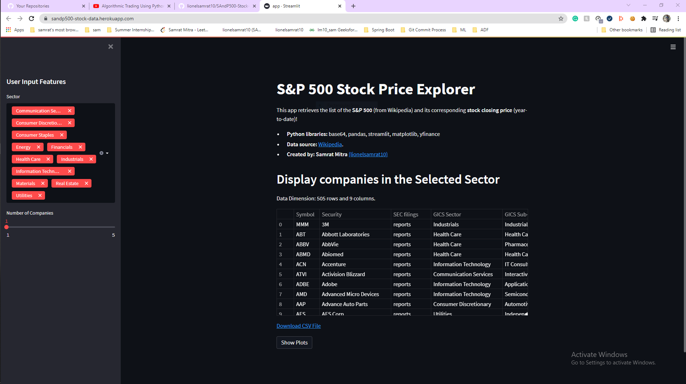
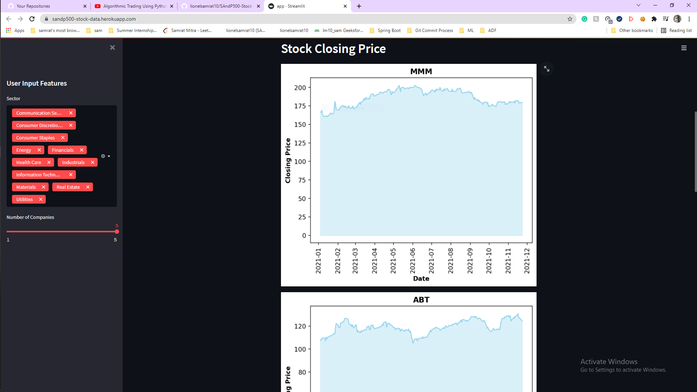

# Web application to explore the S&P500 Stocks

A real time deployed web application that is built using data, scraped from Wikipedia, that explores S&P500 Companies and their stock details. You can also view the different sector of companies and can sort the companies according to the sectors. You can also download the data of the companies in csv format for your future uses.  Plesae ⭐ this repository if you found it useful.

### Technologies Used :

* `Python`
* `Streamlit`
* `Matplotlib` 
* `Pandas`
* `base64`
* `YFinance (For getting Stock data of the companies)`

## Preview

### Installation :

A good practice to start with a new project and use it, is to make a virtual enviornment for the particular project. Here is the steps for making virtual enviornment ::

1. `pip install virtualenv`
2. `python -m virtualenv myenv`

#### Install the dependencies of the App ::

Run commands on python terminal or anaconda terimial or any terminal you are using in your system.

* `pip install -r requirements.txt`

### Test :
* Run `streamlit run app.py`.
* The app will be up and running at the following URL `http://localhost:8501/`
* Now explore the app

### Deployed Version

* The app is deployed using heroku: [Click here](https://sandp500-stock-data.herokuapp.com/)

Hope you like this project !!! 
